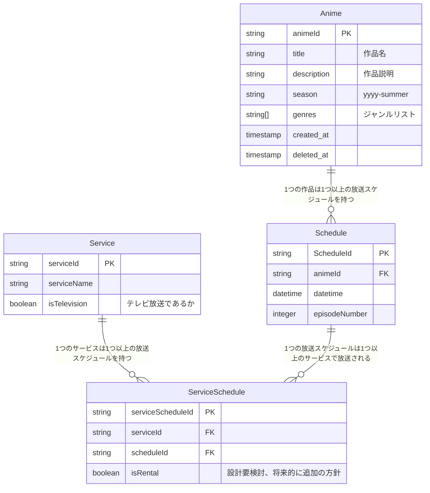

# ER Diagrams

```mermaid
erDiagram
  Anime ||--o{ Schedule : "1つの作品は1つ以上の放送スケジュールを持つ"
  Service ||--o{ ServiceSchedule : "1つのサービスは1つ以上の放送スケジュールを持つ"
  Schedule ||--o{ ServiceSchedule : "1つの放送スケジュールは1つ以上のサービスで放送される"

  Anime {
    string animeId PK
    string title "作品名"
    string description "作品説明"
    string season "yyyy-summer"
    string[] genres "ジャンルリスト"
    timestamp created_at
    timestamp deleted_at
  }

  Schedule {
    string ScheduleId PK
    string animeId FK
    datetime datetime
    integer episodeNumber
  }

  ServiceSchedule {
    string serviceScheduleId PK
    string serviceId FK
    string scheduleId FK
    boolean isRental "設計要検討、将来的に追加の方針"
  }

  Service {
    string serviceId PK
    string serviceName
    boolean isTelevision "テレビ放送であるか"
  }


```
